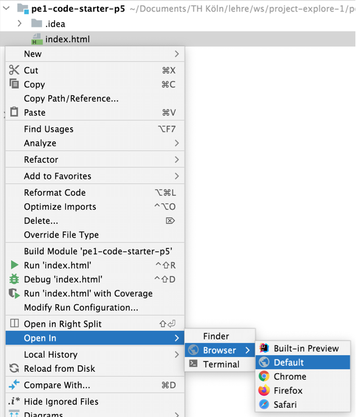

Das CoCo-Dashboard (Project Explore 1 - WS 2023/24)
===================================================

Dies ist ein Code-Starter für Project Explore 1 im Wintersemester 2023/24 mit einem Beispiel.
Die technische Basis zur Umsetzung ist [p5.js](https://p5js.org/).

Entwicklung auf dem eigenen Rechner
-----------------------------------

* `git clone <repo-url>`
* Datei `index.html` in Browser öffnen.  
  
* Experimentieren ... (d.h. Dateien bearbeiten).
* Das Ergebnis aktualisiert sich im Browser automatisch. 
  (Wenn die automatische Aktualisierung nicht mehr funktioniert, Tab schließen und Datei wie oben neu öffnen.)

**Hinweis**: Wenn du sehen willst, was ein [`print()`](https://p5js.org/reference/#/p5/print) ausgegeben hat, öffne die Entwickler-Werkzeuge des Browsers mit `F12` und schau auf die Konsole.

Nützliche Funktionen von p5js
-----------------------------

* Daten im JSON-Format laden: [loadJSON](https://p5js.org/reference/#/p5/loadJSON)
* Daten im CSV-Format laden: [loadTable](https://p5js.org/reference/#/p5/loadTable)
* Daten in Pixel umrechnen: [map](https://p5js.org/reference/#/p5/map)

Datenquellen
------------

Mögliche Schnittstellen und APIs für Daten

* Umwelt
  * https://spassmitdaten.de/2018/12/10/meterologisches-institut-norwegen-weather-api-v-3/ // https://api.met.no/weatherapi/  
    DTD: Keine Keys notwendig, viele End-Points mit verschiedenen Formaten, einfache Dokumentation
  * https://www.wind-watch.org/documents/real-time-wind-production-various-regions/
  * https://darksky.net/
  * https://openweathermap.org
  * https://earthquake.usgs.gov/earthquakes/feed/v1.0/summary/all_day.geojson
* Verkehr
  * KVB: https://www.kvb.koeln/service/open_data.html
* CoCo
  * Gitlab: https://git.coco.study/help/api/api_resources.md
  * Kalender
* State & Public
  * https://www.govdata.de/
  * Smart City Dashboard Münster: https://www.govdata.de/web/guest/suchen/-/details/25
* Space & Earth
 * https://api.nasa.gov/ // DTD: Einfache Registrierung
 * https://developer.flightstats.com/api-docs/flightstatus/v2
* Mastodon API:  
  Dokumentation: https://docs.joinmastodon.org/client/intro/  
  Client Lib: https://github.com/Kirschn/mastodon.js
* Daten aus einem Google Spreadsheet nutzen:
  * [opensheet](https://github.com/benborgers/opensheet) (Dokument muss öffentlich lesbar sein!)
  * via _publish on the web_ & `loadTable()` [siehe dieses Tutorial-Video](https://www.youtube.com/watch?v=EU7SvAyybOE&ab_channel=DavidBouchard)

Literatur
---------

* Few, S. - Information Dashboard Design: The Effective Visual Communication of Data, O'Reilly Media, Incorporated, 2006 - 211 Seiten
* [Why Most Dashboards Fail](http://www.perceptualedge.com/brochures/Why_Most_Dashboards_Fail.pdf)
* Fry, Ben – Visualizing Data: Exploring and Explaining Data with the Processing Environment
* Gross, Benedikt et al. – Generative Design: Visualize, Program, and Create with Processing
* Reas, Casey et al. – Form+Code in Design, Art, and Architecture
* Shiffman, Daniel – Learning Processing: A Beginner's Guide to Programming Images, Animation, and Interaction